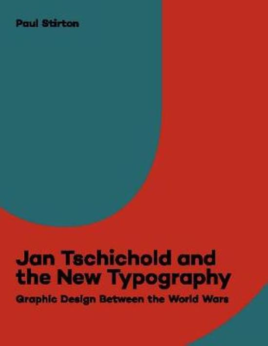
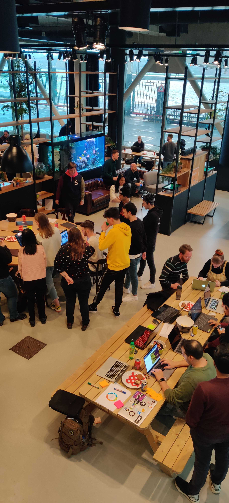
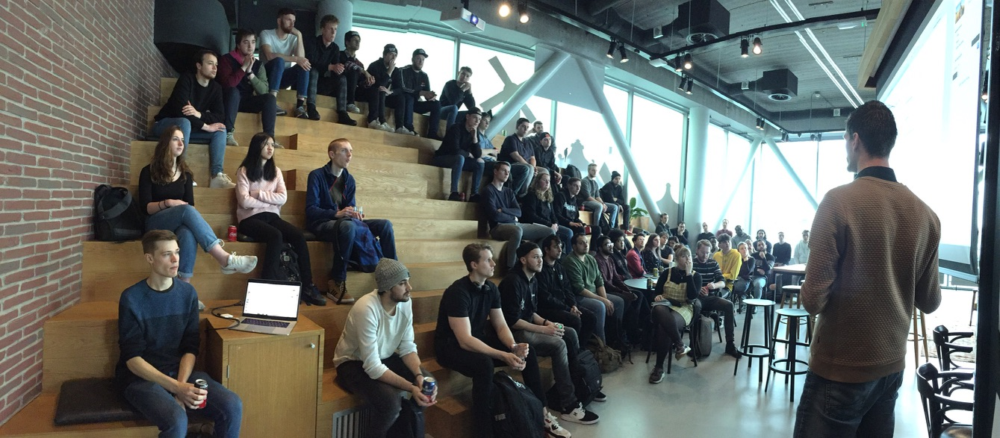
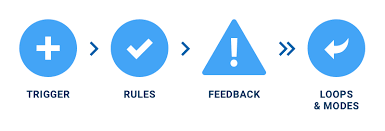
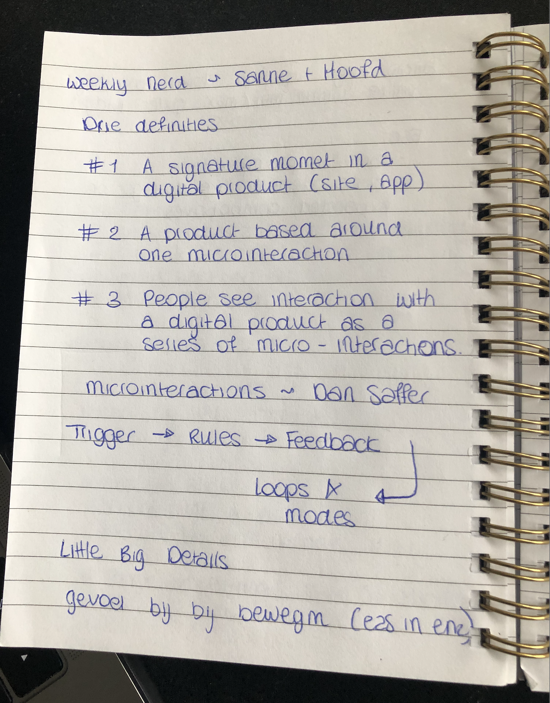
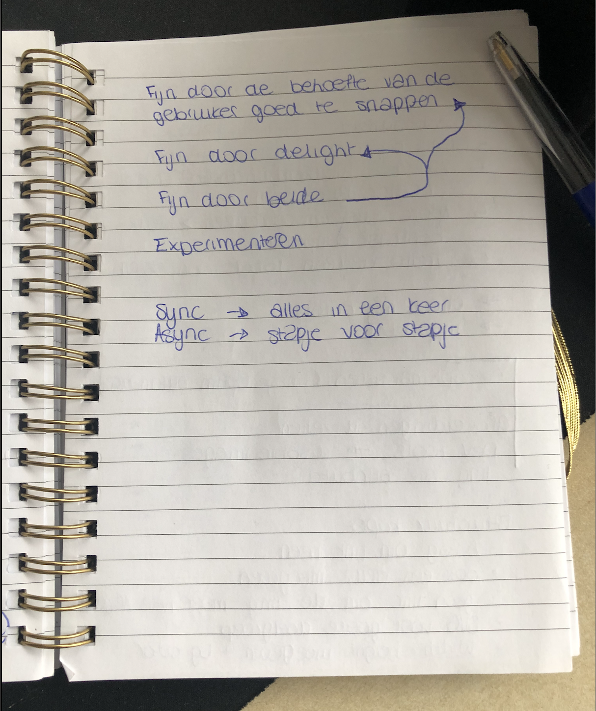
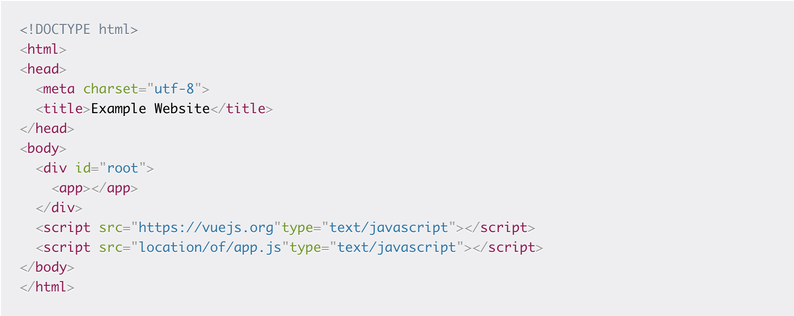
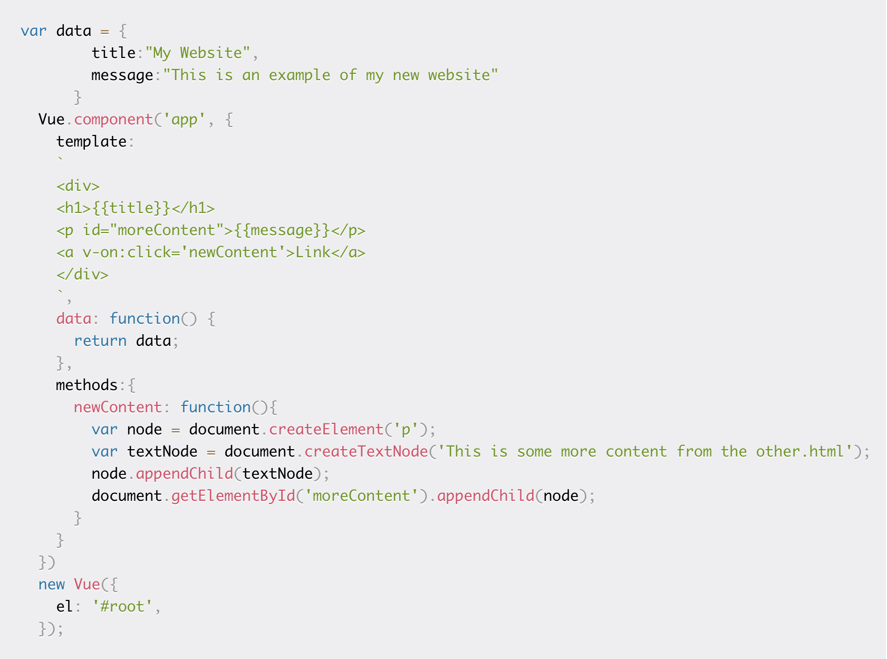

# Weekly Nerd

Welkom bij mijn weelky nerd! Het afgelopen jaar hebben we iedere week een gastcollege gekregen van bedrijvene en opdrachtgevers. Soms op school, en soms gingen we bij de bedrijven op bezoek. In totaal heb ik 5 gastcoleges gehad.

## Inhoudsopgave

- [Geweldig Grafisch Ontwerp](#Geweldig-Grafisch-Ontwerp)
- [Funda Workshop](#Funda-Workshop)
- [Sanne t Hoofd](#Sanne-t-Hoofd)

## Artikelen

- [Server side vs Client Side renderen](#Server-side-vs-Client-Side-renderen)

### Geweldig Grafisch Ontwerp

#### Inleiding

De eerste Weekly Nerd werd gegeven door Hidde de Vries op 13 februari op de HvA. Hij is op dit moment een freelancer en oud collega van Vasilis.

Hidde de Vries 13 februari

#### Geweldig Grafisch ontwerp toepassen op het web

Aan het begin van het college begon Hidde met een heleboel inspiratie vanuit oude schilders. Hidde vind het zonde dat we ons beperkt houden in het web. We kunnen zoveel gave iedeen bedenken, maar houden ons vaken binnen de lijntjes wat ieder bedrijf doet. Facebook spendeert bijvoorbeeld dagen aan het aanpassen van een icootje in de navigatiebalk, en kijkt of dit impact heeft. Hij vind dat onzin en wilt zich op het "wow-effect" van de gebruiker richten. Zodra de gebruiker dit effet voelt op jouw website zal het ten alle tijden beter blijven hangen.

> "De neue typografie ~ Jan Tschichold"
> 

Deze typografie is gemaakt voor het web. Vroeger waren letters en logo's van bedrijven heel sierlijk. Het moet goed leesbaar blijven dus in de afgelopen jaren zijn veel bedrijven hun huisstijl gaan versimpelen. De moderne tijden vragen functie boven vorm.

> "Josef Buller Brockman", Grids zijn functioneel, logisch en "mooier"."

> "New Alphabet ~ Wim Grouwel"
> Later kwam het nieuwe alfabet van wil grouwel. Dit alfabet is ontworpen zodat het in een GRID past.

#### De revolutie van Grafisch ontwerp

Teveel objectiviteit maken layouts saai. Vroeger was dit al veel meer het geval dan vroeger. Het is nu mogelijk om geweldige grafische ontwerpen te maken en toe te passen in het web door de nieuwe layout modes van CSS: Flexbox en GRID. Verder is de Z-index ook later aan CSS toegevoegd waarmee je veel meer kanten op kunt.

Een aantal tips die hidde gaf tijdens zijn college:

> Houd je fallbacks zo simpel mogelijk en experimenteer samen.
> Tekst is beter dan plaatjes van tekst (voor blinden enz.)
> Als je CSS aan het leren bent, blijf zo dicht mogelijk bij de standaarden.

> Kies Vanilla!

#### Interessante Bronnen voor het spelen met Layouts

- [Jen Simons](https://jensimmons.com/)
- [Flexbox Froggy](https://flexboxfroggy.com/)
- [Grid Garden](https://cssgridgarden.com/)

### Funda Workshop

#### Inleiding

Voor deze workshop moesten we op 26 februari het bedrijf van Funda toe. Hier kregen we eerst een korte uitleg over het bedrijf en vervolgens moesten we aan de slag.

Funda 26 februari

#### Instaleren

Als eerste moesten we naar de repository op Github
[Repository Funda](https://github.com/larsdouweschuitema/workshop-frontend-minor)

> Installeer node
> Installeer yarn
> Clone de repository en wijzig de route voor het bestand
> `git clone https://github.com/larsdouweschuitema/workshop-frontend-minor.git && cd workshop-frontend-minor`

Installeer Yarn
`yarn install`

Opstarten
`yarn run dev`

#### Funda; het bedrijf

Aan het begin van de workshop kregen we een korte presentatie over het bedrijf zelf. Bij funda is de verdeling van Man en Vrouw 64/32. Ze zijn iedere dag bezig met het bouwen van nieuwe features en het verbeteren van de website. Hiervoor zijn er vershillende teams.

#### De Workshop

Voor de workshop had Funda een API aangemaakt met een vrij simpele website. Deze was gebouwt in VUE. De studenten werden opgedeeld in 5 teams, en kregen ieder een eigen feature van de website die we moesten verbeteren.

Wij waren met 10 studenten team 2 en hadden de filter van de prijs in de sidebar. Een iemand was de projetleider en moest iedereen aansturen, en overleggen met de andere teams. Het verdelen van de taken was erg lastig omdat het in eerste instantie een hele kleine opdracht leek. Uiteindelijk hebben we 3 mensen op de stijling gezet. 3 studenten gingen uitzoeken hoe VUE precies werkt omdat niemand hier nog ervaring mee heeft. De laatste 4 studenten gingen de prijzen onderverdelen in categorien en het maken van een eventlistener voor het filteren.

Het eerste half uur van de workshop verliep erg stroef. Dit kwam omdat het voor niemand precies duidelijk was hoe we het moesten aanpakken.

Ik zat zelf in het groepje van de styling. Ik had heel veel errors in mijn terminal waardoor ik daar heel veel tijd aan verloren ben. Toen ik eindelijk aan het werk kon en wat styling wilde veranderen lukte mij dit alleen op de teksten. Als ik styling toepaste op de dropdown button kon de hele pagina niet meer laden en kreeg ik een nieuwe error in mijn terminal.

Het grootste doel van de workshop was om merge conflicten te maken en deze samen met andere teams op te lossen. Zo ver waren wij helaas niet gekomen doordat de start heel stroef verliep en we eigenlijk te weinig tijd hadden om het werkend te maken.

Ik heb voor deze workshop geen aantekeningen gemaakt omdat we vooral bezig waren met het schrijven van codes. Gelukkig zijn er wel foto's gemaakt:

### Sanne t Hoofd

#### Inleiding

Sanne t Hoofd is een docent op de HvA. Ik heb heb in het eerste jaar ook gehad voor Human Computer Interaction. Inmiddels is er in het eerste jaar een keuzevak bijgekomen wat voor een groot deel lijkt op CSS to the Rescue. Sannen liet een aantal eindprojecten zien van de eerste jaars studenten en ik was zwaar onder de indruk van wat ze allemaal al konden maken.

Sanne t Hoofd

#### Drie definities Microinteracties ~ Dan Saffer

- 1. A signature moment in a digital product (site, app)
- 2. A product based around one microinteraction
- 3. People see interaction with a digital product as a series of micro-interactions.

Voor microinteracties kunnen een aantal factoren heel goed mee helpen bij het gevoel van beweging, zoals ease in en ease out. Sanne gaf aan dat je in principe nooit voor lineair moet gaan omdat dit er ten alle tijden gemaakt uit zal zien. Iets wat leeft kan nooit precies lineair lopen.

Voor het maken van een goede website is het ontzettend belangrijk om de behoefte van de gebruiker goed te snappen. Hierdoor kun je een fijne interactie creeren. Verder is het erg belangrijk om te experimenteren met de interacties, zoals AB testing om te zien wat het beste werkt voor de gebruiker.

Aantekeningen Weekly Nerd Sanne

#### Interessante Bronnen

- [Website Sanne](https://www.sinds1971.nl/)
- [Little Big Details](https://littlebigdetails.com/)
- [Microinteractions ~Dan Saffer](http://1.droppdf.com/files/ft5ct/oreilly-microinteractions-full-color-edition-2014.pdf)

### Server side vs Client Side renderen

#### Inleiding

Voor het vak Progressive Web Apps gaan we een applicatie die Client Side was gerenderd ombouwen naar een server side gerenderde pagina. Om goed te kunnen begrijpen wat hier precies gebeurd wil ik weten wat nou precies het verschil is tussen deze twee manieren van renderen.

Sinds het begin van de tijd was de conventionele methode om uw HTML op een scherm te krijgen, het gebruik van server-side rendering. Het was de enige manier. U laadde uw .html-pagina's op uw server, vervolgens ging uw server en veranderde ze in nuttige documenten in de browsers van uw gebruikers. Je zou kunnen stellen dat websites tegenwoordig meer lijken op applicaties die zich voordoen als websites. Het web is gewoon een stuk geavanceerder dan vroeger.

Server side vs Client side renderen

#### Server side renderen

Hoe server-side rendering werkt
Server-side rendering is de meest gebruikelijke methode om informatie op het scherm weer te geven. Het werkt door HTML-bestanden op de server om te zetten in bruikbare informatie voor de browser.Telkens wanneer u een website bezoekt, doet uw browser een verzoek aan de server die de inhoud van de website bevat. Het verzoek duurt meestal maar een paar milliseconden, maar dat hangt uiteindelijk af van een groot aantal factoren:

- Uw internetsnelheid
- De locatie van de server
- Hoeveel gebruikers toegang tot de site proberen te krijgen
- Hoe geoptimaliseerd de website is
  (om er maar een paar te noemen)

Zodra het verzoek is verwerkt, krijgt uw browser de volledig gerenderde HTML terug en wordt deze op het scherm weergegeven. Als u vervolgens besluit om een ​​andere pagina op de website te bezoeken, zal uw browser opnieuw een verzoek om de nieuwe informatie indienen. Dit gebeurt elke keer dat u een pagina bezoekt waarvan uw browser geen gecachte versie heeft.

Het maakt niet uit of de nieuwe pagina maar een paar items heeft die anders zijn dan de huidige pagina, de browser zal om de hele nieuwe pagina vragen en alles vanaf de grond opnieuw weergeven.

#### Voordeel server side renderen

Het is super goed voor de SEO doordat de inhoud al aanwezig is voordat je hem hebt ontvangen. Hierdoor kunnen zoekmachines deze indexeren en prima doorzoeken. Dit is niet het geval bij client side renderen. (niet zo eenvoudig in iedergeval)

#### Nadeel server side renderen

Iedere pagina wordt compleet opnieuw geladen, ook al wordt er maar 1 woord aangepast. Hierdoor kan het super lang duren voordat de pagina is geladen. De website kan hier ontzettend sloom van worden.

#### Client Side renderen

Wanneer ontwikkelaars praten over rendering aan de clientzijde, hebben ze het over het renderen van inhoud in de browser met JavaScript. Dus in plaats van alle inhoud uit het HTML-document zelf te halen, krijg je een kaal HTML-document met een JavaScript-bestand dat de rest van de site via de browser zal weergeven.

Dit is een relatief nieuwe benadering voor het renderen van websites en het werd pas echt populair toen JavaScript-bibliotheken het begonnen op te nemen in hun stijl van ontwikkeling. Enkele opvallende voorbeelden zijn Vue.js en React.js.

Er zijn een aantal grote verschillen in de werking van client side renderen. Om te beginnen, in plaats van de inhoud in het HTML-bestand te hebben, heb je een container-div met een id van root. Je hebt ook twee scriptelementen direct boven de afsluitende body-tag. Een die de Vue.js JavaScript-bibliotheek laadt en een die een bestand met de naam app.js. laadt.

Dit is radicaal anders dan het gebruik van server-side rendering omdat de server nu alleen verantwoordelijk is voor het laden van het kale minpuntje van de website. De belangrijkste boilerplate. Al het andere wordt afgehandeld door een JavaScript-bibliotheek aan de clientside, in dit geval Vue.js en aangepaste JavaScript-code.

Als je alleen met de bovenstaande code een verzoek indient bij de URL, krijgt u een leeg scherm. Er hoeft niets te worden geladen omdat de daadwerkelijke inhoud moet worden weergegeven met JavaScript.

Om dat op te lossen, plaatst u de volgende coderegels in het app.js-bestand.

Als u nu de URL bezoekt, ziet u dezelfde inhoud als in het voorbeeld aan de serverside. Het belangrijkste verschil is dat als je op de link op de pagina klikt om meer inhoud te laden, de browser geen nieuw verzoek aan de server zal doen. Je geeft items weer met de browser, dus deze gebruikt in plaats daarvan JavaScript om de nieuwe inhoud te laden en Vue.js zorgt ervoor dat alleen de nieuwe inhoud wordt weergegeven. Al het andere wordt met rust gelaten.

Dit is veel sneller omdat je slechts een heel klein deel van de pagina laadt om de nieuwe inhoud op te halen, in plaats van de hele pagina te laden.

Er zijn echter enkele compromissen met het gebruik van client-side rendering. Omdat de inhoud niet wordt weergegeven totdat de pagina in de browser is geladen, zal SEO voor de website een hit worden. Er zijn manieren om dit te omzeilen, maar het is niet zo eenvoudig als bij het renderen op de server.

Een ander ding om in gedachten te houden is dat uw website / applicatie niet kan laden totdat ALLE JavaScript naar de browser is gedownload. Logisch, want het bevat alle inhoud die nodig is. Als uw gebruikers een trage internetverbinding gebruiken, kan dit de aanvankelijke laadtijd een beetje lang maken.

#### Voor en nadelen van de verschillende aanpak

Voordelen voor de serverside:

- Zoekmachines kunnen de site crawlen voor betere SEO.
- De eerste pagina wordt sneller geladen.
- Geweldig voor statische sites

Nadelen aan serverside:

- Frequente serververzoeken.
- Een algehele trage paginaweergave.
- Herladen van volledige pagina.
- Niet-rijke site-interacties.

Voordelen voor clientside

- Rijke site-interacties
- Snelle website-rendering na de eerste keer laden.
- Ideaal voor webapplicaties.
- Robuuste selectie van JavaScript-bibliotheken.

Nadelen aan clientside:

- Lage SEO indien niet correct geïmplementeerd.
- De eerste keer laden kan meer tijd vergen.
- In de meeste gevallen is een externe bibliotheek vereist

Verschillen server en client side
cookies zijn server side en hebben een maximum opslag van 4kb
local storage is client side en heeft een maximum opslag van 5mb, daarnaast zal local storage langer online blijven.

Na het lezen van deze artikelen is voor mij helemaal duidelijk wat het precieze verschil is tussen serverside en clientside renderen. Dit zal mij veel helpen bij het vak Progressive Web Apps.

#### Interessante Bronnen

- [FreeCodeCamp](https://www.freecodecamp.org/news/what-exactly-is-client-side-rendering-and-hows-it-different-from-server-side-rendering-bd5c786b340d/)
- [Developers](https://www.toptal.com/front-end/client-side-vs-server-side-pre-rendering)
- [Medium](https://medium.com/@benjburkholder/javascript-seo-server-side-rendering-vs-client-side-rendering-bc06b8ca2383)

## Einde

Bedankt voor het lezen van mijn Weekly Nerd.

> Simone van Zeijl
